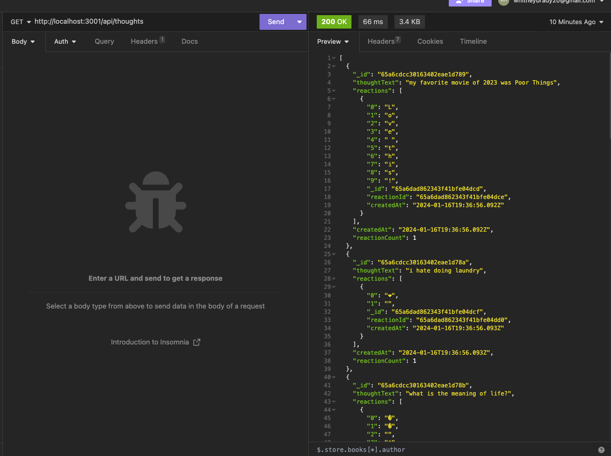
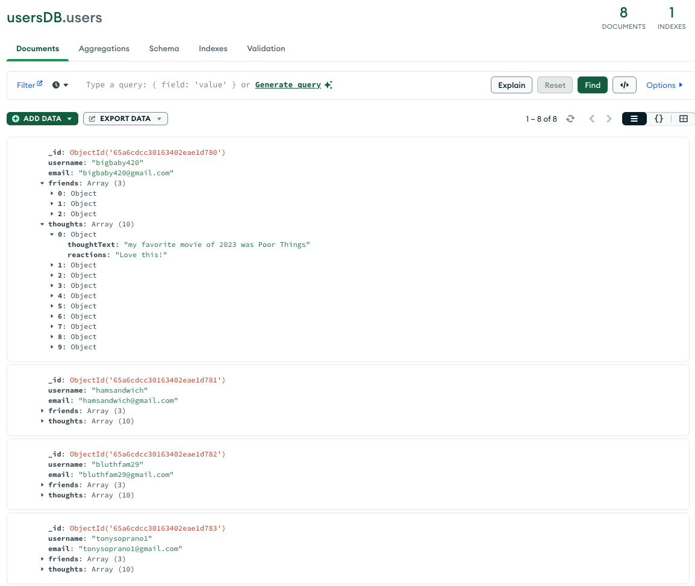

# social network backend

## Description

This project is the backend of a social networking app that uses mongoDB for the database. The backend allows you to create, read, update, and delete users and thoughts. I attempted to add routes for creating and deleting reactions associated with thoughts, but was unsuccessful. The video walkthrough includes GET, POST, PUT, and DELETE routes for both the users and thoughts apis. 

Video of api routes in Insomnia app: https://drive.google.com/file/d/1ZZJqBlarm5ZafvbQUwabjqrpExezrePl/view
Github repo: https://github.com/whitbreezy/social-network

## Installation

You can install this app on your machine by cloning the code in my github linked in the Description section. Once the code is installed, you must run the following commands in the terminal to get the project up and running:

`npm install,
npm run seed,
npm start`

## Usage

You can test the api routes once installed using a browser or Insomnia. 

Below is a screenshot of the get route for thoughts in Insomnia:

Below is a screenshot of the users database in the MongoDB Compass app:

## Credits

I referenced material from module 18 in my coding bootcamp class repo. 

